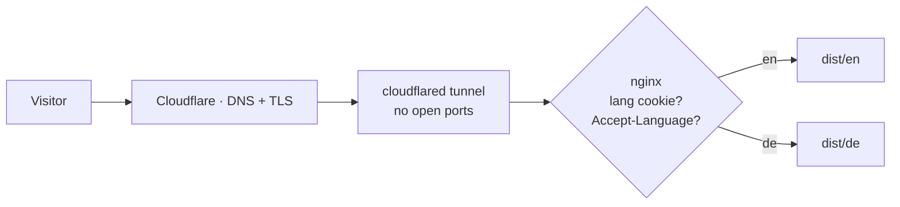

# timo.rzipas.win

[](https://github.com/i7Gamer/timo.rzipas.win/actions/workflows/ci.yml)

My personal website and homelab showcase — **self-hosted on my own hardware** at [timo.rzipas.win](https://timo.rzipas.win).

## How it works

The site is bilingual (English/German) **at identical URLs** — no `/de/` prefixes. Astro builds the whole site once per language, and nginx picks the right tree at request time:



- An explicit `lang` cookie (set by the language switcher) wins
- Otherwise the browser's `Accept-Language` decides
- Default is English; HTML responses carry `Vary: Cookie, Accept-Language`

## Stack

- [Astro 7](https://astro.build) — static output, one build pass per locale (`LOCALE` env → `dist/en` + `dist/de`)
- [Tailwind CSS 4](https://tailwindcss.com) — dark-first terminal theme, light mode toggle
- Self-hosted fonts (Inter, JetBrains Mono) — no external requests at all
- [Vitest](https://vitest.dev) + Astro Container API — unit tests for every helper, render tests for cards
- nginx in Docker — language negotiation, caching, security headers, `/healthz`, live `/status.json`
- GitHub Actions — check, lint, test, build, then multi-arch image to GHCR

## Development

```sh
pnpm install
pnpm dev        # English dev server
pnpm dev:de     # German dev server
pnpm test       # Vitest
pnpm check      # astro check (types)
pnpm lint       # ESLint
pnpm build      # builds BOTH locales into dist/en and dist/de
```

### Adding a language

1. Add the code to `src/i18n/locales.json`
2. Add a dictionary in `src/i18n/ui.ts` and translations in `src/data/*`
3. Add one line to each `map` block in `deploy/nginx.conf`

Untranslated keys automatically fall back to English.

## Deployment (homelab)

Every push to `main` builds `ghcr.io/i7gamer/timo.rzipas.win` (amd64 + arm64). On the server:

```sh
docker compose -f deploy/docker-compose.example.yml up -d
```

Point a Cloudflare Tunnel public hostname at the container (TLS terminates at the Cloudflare edge; nothing is forwarded through the router) and create the DNS record for `timo.rzipas.win`. `GET /healthz` returns `200 ok — served from the living room` (language-negotiated, like the rest of the site) for uptime monitoring.

### Live service status

`/homelab` upgrades its build-time status dots at runtime from `GET /status.json`.
The file is generated on the host by `deploy/update-status.ps1`: copy it next
to your `docker-compose.yml` and point the URLs in its table at your own
services. It writes `status.json` into a `status` folder beside itself, which
is exactly the `./status` volume the compose file mounts read-only into the
container. Every check is a plain HTTP request, so the task needs no Docker
access and runs fine as SYSTEM or with nobody logged on:

```powershell
Register-ScheduledTask -TaskName 'website-status' `
  -User 'SYSTEM' -RunLevel Highest `
  -Trigger (New-ScheduledTaskTrigger -Once -At (Get-Date) -RepetitionInterval (New-TimeSpan -Minutes 5)) `
  -Action (New-ScheduledTaskAction -Execute 'C:/Windows/System32/WindowsPowerShell/v1.0/powershell.exe' -Argument '-NoProfile -ExecutionPolicy Bypass -File "C:/path/to/docker/update-status.ps1"')
```

The script runs on Windows PowerShell 5.1, so the fixed `powershell.exe` path
is used rather than `pwsh`, whose Store install has no reliable path for a
scheduled task. Pass `-OutDir` if the status folder lives somewhere else.

If the file is missing or malformed the page silently keeps its static labels.

## License

Code is [MIT](LICENSE). Personal content (texts, images, CV data) is not covered by the license.
